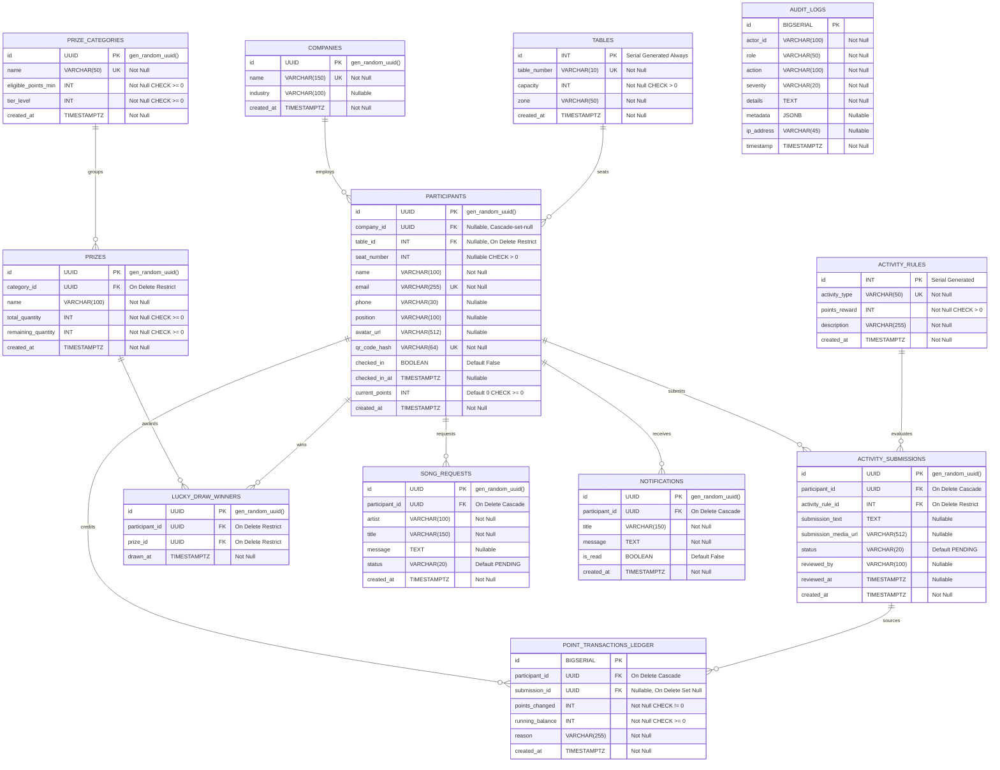

# Production-Ready PostgreSQL Database Design Specification

This document presents a comprehensive, normalized, and enterprise-grade PostgreSQL database schema designed to support high-concurrency event registration, real-time gamified points mechanics, live audit logging, lucky draw pools, and notification streams.

---

## 1. Entity-Relationship Diagram (ERD)

The following Mermaid diagram outlines the normalized relationships, primary keys, and foreign keys across all ten core domains.



---

## 2. Table Definitions (PostgreSQL DDL)

To implement this architecture on a standard PostgreSQL database, use the following schema. This includes primary keys, constraints, defaults, unique values, check constraints, and auto-timestamps.

```sql
-- Enable necessary extensions
CREATE EXTENSION IF NOT EXISTS "uuid-ossp";
CREATE EXTENSION IF NOT EXISTS "pgcrypto";

-- ==========================================
-- 1. COMPANIES LOOKUP TABLE
-- ==========================================
CREATE TABLE companies (
    id UUID PRIMARY KEY DEFAULT gen_random_uuid(),
    name VARCHAR(150) NOT NULL UNIQUE,
    industry VARCHAR(100),
    created_at TIMESTAMPTZ NOT NULL DEFAULT CURRENT_TIMESTAMP
);

-- ==========================================
-- 2. TABLES / VENUE SEATING
-- ==========================================
CREATE TABLE tables (
    id INT GENERATED ALWAYS AS IDENTITY PRIMARY KEY,
    table_number VARCHAR(10) NOT NULL UNIQUE,
    capacity INT NOT NULL CONSTRAINT check_table_capacity CHECK (capacity > 0),
    zone VARCHAR(50) NOT NULL,
    created_at TIMESTAMPTZ NOT NULL DEFAULT CURRENT_TIMESTAMP
);

-- ==========================================
-- 3. PARTICIPANTS (MAIN CORE USER STATE)
-- ==========================================
CREATE TABLE participants (
    id UUID PRIMARY KEY DEFAULT gen_random_uuid(),
    company_id UUID REFERENCES companies(id) ON DELETE SET NULL,
    table_id INT REFERENCES tables(id) ON DELETE RESTRICT,
    seat_number INT CONSTRAINT check_seat_number CHECK (seat_number > 0),
    name VARCHAR(100) NOT NULL,
    email VARCHAR(255) NOT NULL UNIQUE,
    phone VARCHAR(30),
    position VARCHAR(100),
    avatar_url VARCHAR(512),
    qr_code_hash VARCHAR(64) NOT NULL UNIQUE,
    checked_in BOOLEAN NOT NULL DEFAULT FALSE,
    checked_in_at TIMESTAMPTZ,
    current_points INT NOT NULL DEFAULT 0 CONSTRAINT check_min_points CHECK (current_points >= 0),
    created_at TIMESTAMPTZ NOT NULL DEFAULT CURRENT_TIMESTAMP,
    CONSTRAINT check_checked_in_timestamp CHECK (
        (checked_in = FALSE AND checked_in_at IS NULL) OR 
        (checked_in = TRUE AND checked_in_at IS NOT NULL)
    ),
    -- Ensure seat number is unique per table
    CONSTRAINT unique_table_seat UNIQUE (table_id, seat_number)
);

-- ==========================================
-- 4. POINT RULES DEFINITION
-- ==========================================
CREATE TABLE activity_rules (
    id INT GENERATED BY DEFAULT AS IDENTITY PRIMARY KEY,
    activity_type VARCHAR(50) NOT NULL UNIQUE,
    points_reward INT NOT NULL CONSTRAINT check_reward_points CHECK (points_reward > 0),
    description VARCHAR(255) NOT NULL,
    created_at TIMESTAMPTZ NOT NULL DEFAULT CURRENT_TIMESTAMP
);

-- Seed Initial System Rules
INSERT INTO activity_rules (activity_type, points_reward, description) VALUES
('SUBMIT_FEEDBACK', 5, 'Guest submits qualitative event feedback form.'),
('SHARE_PHOTO', 5, 'Guest uploads photo proof of attendance or task.'),
('INSTAGRAM_POST', 5, 'Guest shares story/post with event hashtag.'),
('VIP_REGISTRATION', 10, 'Bonus award granted to designated key VIP profiles.');

-- ==========================================
-- 5. ACTIVITY SUBMISSIONS (GAMIFICATION PROOF)
-- ==========================================
CREATE TABLE activity_submissions (
    id UUID PRIMARY KEY DEFAULT gen_random_uuid(),
    participant_id UUID NOT NULL REFERENCES participants(id) ON DELETE CASCADE,
    activity_rule_id INT NOT NULL REFERENCES activity_rules(id) ON DELETE RESTRICT,
    submission_text TEXT,
    submission_media_url VARCHAR(512),
    status VARCHAR(20) NOT NULL DEFAULT 'PENDING' CONSTRAINT check_submission_status CHECK (status IN ('PENDING', 'APPROVED', 'REJECTED')),
    reviewed_by VARCHAR(100),
    reviewed_at TIMESTAMPTZ,
    created_at TIMESTAMPTZ NOT NULL DEFAULT CURRENT_TIMESTAMP
);

-- ==========================================
-- 6. POINT TRANSACTION LEDGER (DOUBLE-ENTRY BALANCE INTEGRITY)
-- ==========================================
CREATE TABLE point_transactions_ledger (
    id BIGSERIAL PRIMARY KEY,
    participant_id UUID NOT NULL REFERENCES participants(id) ON DELETE CASCADE,
    submission_id UUID REFERENCES activity_submissions(id) ON DELETE SET NULL,
    points_changed INT NOT NULL CONSTRAINT check_points_changed CHECK (points_changed <> 0),
    running_balance INT NOT NULL CONSTRAINT check_running_balance CHECK (running_balance >= 0),
    reason VARCHAR(255) NOT NULL,
    created_at TIMESTAMPTZ NOT NULL DEFAULT CURRENT_TIMESTAMP
);

-- ==========================================
-- 7. PRIZE CATEGORIES & SYSTEM TIERS (LUCKY DRAW)
-- ==========================================
CREATE TABLE prize_categories (
    id UUID PRIMARY KEY DEFAULT gen_random_uuid(),
    name VARCHAR(50) NOT NULL UNIQUE,
    eligible_points_min INT NOT NULL DEFAULT 0 CONSTRAINT check_eligible_points CHECK (eligible_points_min >= 0),
    tier_level INT NOT NULL UNIQUE CONSTRAINT check_tier_level CHECK (tier_level >= 0),
    created_at TIMESTAMPTZ NOT NULL DEFAULT CURRENT_TIMESTAMP
);

-- Seed Standard Tiers
INSERT INTO prize_categories (name, eligible_points_min, tier_level) VALUES
('Bronze Tier Selections', 0, 1),
('Silver Tier Selections', 11, 2),
('Gold Tier Selections', 21, 3);

-- ==========================================
-- 8. PRIZES INVENTORY
-- ==========================================
CREATE TABLE prizes (
    id UUID PRIMARY KEY DEFAULT gen_random_uuid(),
    category_id UUID NOT NULL REFERENCES prize_categories(id) ON DELETE RESTRICT,
    name VARCHAR(100) NOT NULL,
    total_quantity INT NOT NULL CONSTRAINT check_total_qty CHECK (total_quantity >= 0),
    remaining_quantity INT NOT NULL CONSTRAINT check_remaining_qty CHECK (remaining_quantity >= 0),
    created_at TIMESTAMPTZ NOT NULL DEFAULT CURRENT_TIMESTAMP,
    CONSTRAINT check_qty_bounds CHECK (remaining_quantity <= total_quantity)
);

-- ==========================================
-- 9. LUCKY DRAW WINNERS (FINAL TAX & SECURITY AUDIT Compliance)
-- ==========================================
CREATE TABLE lucky_draw_winners (
    id UUID PRIMARY KEY DEFAULT gen_random_uuid(),
    participant_id UUID NOT NULL REFERENCES participants(id) ON DELETE RESTRICT,
    prize_id UUID NOT NULL REFERENCES prizes(id) ON DELETE RESTRICT,
    drawn_at TIMESTAMPTZ NOT NULL DEFAULT CURRENT_TIMESTAMP,
    -- Strict Rule: One participant can win at most one prize in the entire event
    CONSTRAINT unique_one_prize_per_guest UNIQUE (participant_id)
);

-- ==========================================
-- 10. SONG REQUESTS BOARD (LIVE MUSIC COOPERATION)
-- ==========================================
CREATE TABLE song_requests (
    id UUID PRIMARY KEY DEFAULT gen_random_uuid(),
    participant_id UUID NOT NULL REFERENCES participants(id) ON DELETE CASCADE,
    artist VARCHAR(100) NOT NULL,
    title VARCHAR(150) NOT NULL,
    message TEXT,
    status VARCHAR(20) NOT NULL DEFAULT 'PENDING' CONSTRAINT check_song_status CHECK (status IN ('PENDING', 'APPROVED', 'PLAYED', 'REJECTED')),
    created_at TIMESTAMPTZ NOT NULL DEFAULT CURRENT_TIMESTAMP
);

-- ==========================================
-- 11. NOTIFICATIONS FOR PARTICIPANTS (IN-APP RECEPTACLE)
-- ==========================================
CREATE TABLE notifications (
    id UUID PRIMARY KEY DEFAULT gen_random_uuid(),
    participant_id UUID NOT NULL REFERENCES participants(id) ON DELETE CASCADE,
    title VARCHAR(150) NOT NULL,
    message TEXT NOT NULL,
    is_read BOOLEAN NOT NULL DEFAULT FALSE,
    created_at TIMESTAMPTZ NOT NULL DEFAULT CURRENT_TIMESTAMP
);

-- ==========================================
-- 12. AUDIT LOGS (ADMIN TELEMETRY & SECURITY LEDGER)
-- ==========================================
CREATE TABLE audit_logs (
    id BIGSERIAL PRIMARY KEY,
    actor_id VARCHAR(100) NOT NULL, -- UUID or username of Administrator/System agent
    role VARCHAR(50) NOT NULL,     -- 'SUPER_ADMIN', 'HOST', 'SYSTEM'
    action VARCHAR(100) NOT NULL,  -- e.g. 'APPROVE_PHOTO_SUBMISSION', 'SPIN_LUCKY_DRAW', 'MANUAL_POINT_ADJUST'
    severity VARCHAR(20) NOT NULL CONSTRAINT check_log_severity CHECK (severity IN ('INFO', 'SUCCESS', 'WARNING', 'ERROR')),
    details TEXT NOT NULL,
    metadata JSONB,                -- Structured old/new state representations, rate limit traces
    ip_address VARCHAR(45),        -- Supports both IPv4 and IPv6
    timestamp TIMESTAMPTZ NOT NULL DEFAULT CURRENT_TIMESTAMP
);
```

---

## 3. High-Performance Indexing Strategy

To support **1,000+ active concurrent users** hitting APIs, scanning QR codes, uploading snapshots, and polling leaderboards, we must define targeted index keys.

```sql
-- 1. Rapid QR Check-In lookup: Instant scan decoding on event entrance
CREATE INDEX idx_participants_qr ON participants (qr_code_hash) WHERE checked_in = FALSE;

-- 2. Seating search and listing
CREATE INDEX idx_participants_seating ON participants (table_id, seat_number);

-- 3. Live Leaderboard performance: High-frequency ORDER BY points DESC index
--    Covers filtering by check-in status to render the live active board
CREATE INDEX idx_participants_points_leaderboard ON participants (checked_in, current_points DESC);

-- 4. Fast pending photo and proof moderation queue for hosts
CREATE INDEX idx_submissions_pending_moderation ON activity_submissions (status) WHERE status = 'PENDING';

-- 5. Double-entry validation on transactions
CREATE INDEX idx_point_ledger_lookup ON point_transactions_ledger (participant_id, created_at DESC);

-- 6. Live Band song request dashboard (Pending songs ordered chronologically)
CREATE INDEX idx_songs_pending_dashboard ON song_requests (status, created_at ASC) WHERE status = 'PENDING';

-- 7. Unread notification counts (minimizes latency on user header components)
CREATE INDEX idx_notifications_unread ON notifications (participant_id) WHERE is_read = FALSE;

-- 8. GIN Index on Audit logs metadata for nested JSON searching
CREATE INDEX idx_audit_metadata_gin ON audit_logs USING gin (metadata);
CREATE INDEX idx_audit_timestamp ON audit_logs (timestamp DESC);
```

---

## 4. Double-Entry Points Ledger Integrity & Triggers

To prevent race conditions where a concurrent request awards a user twice or creates mathematical mismatches, the points balance updates are protected by database-level triggers. 

### Trigger: Update `current_points` in `participants` on Ledger Insert

This ensures the `participants` table point balance is always a direct representation of the transaction ledger stream, removing any chance of out-of-sync values.

```sql
CREATE OR REPLACE FUNCTION update_participant_points_from_ledger()
RETURNS TRIGGER AS $$
BEGIN
    -- Update participant points
    UPDATE participants
    SET current_points = current_points + NEW.points_changed
    WHERE id = NEW.participant_id;

    -- Safety check: ensure points never drop below zero due to any manual reverse
    IF EXISTS (SELECT 1 FROM participants WHERE id = NEW.participant_id AND current_points < 0) THEN
        RAISE EXCEPTION 'Ledger transaction failed: point balance cannot drop below zero.';
    END IF;

    RETURN NEW;
END;
$$ LANGUAGE plpgsql;

CREATE TRIGGER trg_on_ledger_insert
AFTER INSERT ON point_transactions_ledger
FOR EACH ROW
EXECUTE FUNCTION update_participant_points_from_ledger();
```

---

## 5. Security & Concurrency Controls

### 5.1 Race Conditions in Lucky Draw (Transaction Isolation)
When the Lucky Draw Spinner triggers, multiple threads could attempt to register a draw. We must ensure:
1. One participant cannot be drawn twice.
2. Prize remaining inventory doesn't drop below zero.

We solve this using **Pessimistic Locking (`SELECT FOR UPDATE`)** inside an isolated PostgreSQL transaction block.

```sql
-- Example logic for drawing a winner for a specified Category:
-- This transaction block runs on the backend server
BEGIN;

-- 1. Select the prize item from the chosen category and lock the row to avoid over-drawing
SELECT id, remaining_quantity 
FROM prizes 
WHERE category_id = 'TARGET_CATEGORY_UUID_HERE' 
  AND remaining_quantity > 0
LIMIT 1 
FOR UPDATE;

-- 2. Find a random eligible participant who is checked in, matches the point threshold,
--    and has not won ANY prizes yet. Lock the row to prevent other concurrent draws.
SELECT p.id, p.name 
FROM participants p
WHERE p.checked_in = TRUE
  AND p.current_points >= (SELECT eligible_points_min FROM prize_categories WHERE id = 'TARGET_CATEGORY_UUID_HERE')
  AND p.id NOT IN (SELECT participant_id FROM lucky_draw_winners)
ORDER BY RANDOM()
LIMIT 1
FOR UPDATE SKIP LOCKED; -- SKIP LOCKED prevents blocking if other categories are spun simultaneously

-- 3. Insert into Winner Log
INSERT INTO lucky_draw_winners (participant_id, prize_id, drawn_at)
VALUES ('WINNER_PARTICIPANT_UUID', 'PRIZE_UUID', CURRENT_TIMESTAMP);

-- 4. Decrement the prize inventory
UPDATE prizes
SET remaining_quantity = remaining_quantity - 1
WHERE id = 'PRIZE_UUID';

COMMIT;
```

---

## 6. Migration Plan & Strategy

For an enterprise event workspace with 100% availability targets:

### Step 1: Baseline Migration (Pre-Event)
Execute the complete core DDL scripts during preparation. Configure connection strings with high-availability pool settings in the server container.

### Step 2: Validation Check
Verify all constraint checks (`check_min_points`, `unique_table_seat`, `unique_one_prize_per_guest`) are registered correctly. Ensure GIN extensions are functional.

### Step 3: Performance Check
Run `EXPLAIN ANALYZE` on mock leaderboard queries to verify the database optimizer is selecting the `idx_participants_points_leaderboard` index.

---

## 7. Performance & High-Availability Recommendations

1. **Connection Pooling**: Use **PgBouncer** in `transaction` pooling mode placed in front of the PostgreSQL cluster. Set maximum pool size inside backend servers appropriately to minimize client connection exhaustion.
2. **Vacuuming**: Event databases experience massive write bursts (e.g. 10,000 point modifications in 4 hours). Configure a aggressive Autovacuum setting on the `point_transactions_ledger` and `activity_submissions` tables to prevent dead tuple bloat.
3. **Partitioning**: If the audit logging gets massive across consecutive multi-day summits, partition the `audit_logs` table by `RANGE (timestamp)` on a monthly or daily basis.
4. **Read Replica**: Offload heavy rendering queries (like compiling statistics dashboards, exporting high volume CSV audits) onto a read-only PostgreSQL replica, keeping the write-master dedicated to registrations, point changes, and lucky spins.
